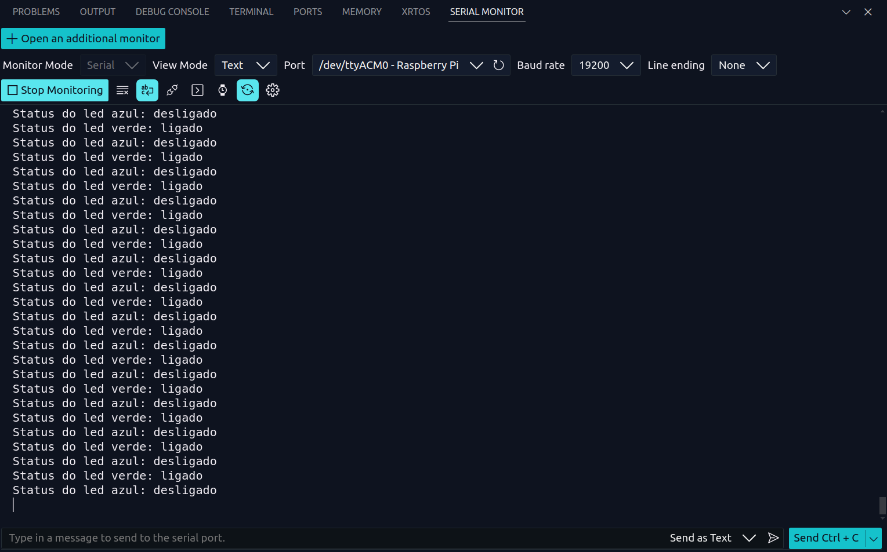

<div align="center">
    
</div>

<br>


<div align="center">

# Introdução às Interfaces de Comunicação Serial

</div>

## Introdução
Este projeto tem como objetivo explorar as interfaces de comunicação serial do microcontrolador RP2040 utilizando a placa de desenvolvimento BitDogLab. A implementação aborda conceitos de UART, I2C e manipulação de LEDs comuns e endereçáveis, bem como a interação com botões e a exibição de informações em um display OLED SSD1306.

## Objetivos
- Compreender o funcionamento e a aplicação de comunicação serial em microcontroladores.
- Aplicar conhecimentos sobre UART e I2C na prática.
- Manipular e controlar LEDs comuns e LEDs endereçáveis WS2812.
- Fixar o estudo do uso de botões de acionamento, interrupções e debounce.
- Desenvolver um projeto funcional que combine hardware e software.

## Componentes Utilizados
- **Matriz 5x5 de LEDs WS2812** - GPIO 7
- **LED RGB** - GPIOs 11, 12 e 13
- **Botão A** - GPIO 5
- **Botão B** - GPIO 6
- **Display SSD1306** via I2C - GPIOs 14 e 15

## Formalidades do Projeto

#### 1. Modificação da Biblioteca `font.h`
- Adicionar caracteres minúsculos à biblioteca `font.h`.
- Criar novos caracteres utilizando criatividade.

### 2. Entrada de Caracteres via PC
- Utilização do Serial Monitor do VS Code para entrada de caracteres.
- Exibição do caractere digitado no display SSD1306.
- Exibição de um símbolo correspondente a números de 0 a 9 na matriz 5x5 WS2812.

### 3. Interação com o Botão A
- Pressionar o Botão A alterna o estado do LED RGB Verde.
- Registra a operação:
  - Exibe uma mensagem no display SSD1306.
  - Envia um texto descritivo ao Serial Monitor.

### 4. Interação com o Botão B
- Pressionar o Botão B alterna o estado do LED RGB Azul.
- Registra a operação:
  - Exibe uma mensagem no display SSD1306.
  - Envia um texto descritivo ao Serial Monitor.

## Requisitos do Projeto
1. **Uso de Interrupções** - As funcionalidades relacionadas aos botões devem ser implementadas utilizando rotinas de interrupção (IRQ).
2. **Debouncing** - Implementação do tratamento de bouncing dos botões via software.
3. **Controle de LEDs** - O projeto deve incluir LEDs comuns e LEDs WS2812, demonstrando domínio de diferentes tipos de controle.
4. **Utilização do Display 128x64** - Exibição de fontes maiúsculas e minúsculas utilizando o protocolo I2C.
5. **Envio de informação pela UART** - Demonstração da comunicação serial via UART.
6. **Organização do Código** - O código deve estar bem estruturado e comentado para facilitar o entendimento.

## Visualização de Caracteres na Matriz de Leds

A exibição de caracteres na matriz de LEDs usando LEDs WS2812 e o Raspberry Pi Pico é detalhada a seguir.

### **1. Mapeamento de Caracteres para a Matriz de LEDs**
A função `set_character_matrix(char character, bool *led_buffer)` define um padrão de ativação dos LEDs para representar caracteres individuais.

- Cada caractere possui uma matriz de 5x5 (25 LEDs) representada por um array `bool pattern[NUM_PIXELS]`, onde:
  - `1` significa que o LED correspondente será aceso.
  - `0` significa que o LED permanecerá apagado.
- O `memcpy(led_buffer, pattern, sizeof(pattern))` copia esse padrão para o buffer `led_buffer`, que armazena os estados dos LEDs.

#### **Exemplo:**
O caractere `'o'` tem o seguinte padrão:
```
0  0  1  0  0  
0  1  0  1  0  
0  0  1  0  0  
0  0  0  0  0  
0  0  0  0  0  
```
Isso significa que apenas os LEDs correspondentes a `1` serão ativados para formar o número `0` na matriz.

### **2. Configuração e Envio dos Pixels para a Matriz de LEDs**
O controle dos LEDs WS2812 é feito via a **PIO (Programmable I/O) do Raspberry Pi Pico**.

#### **2.1. Definição de cores no formato GRB**
A função `urgb_u32(uint8_t r, uint8_t g, uint8_t b)` converte os valores de vermelho (R), verde (G) e azul (B) para um valor de 32 bits no formato GRB:

```c
return ((uint32_t) (r) << 8) | ((uint32_t) (g) << 16) | (uint32_t) (b);
```
Os LEDs WS2812 utilizam a ordem **GRB** (Green-Red-Blue) e não **RGB**, então essa conversão é necessária.

#### **2.2. Envio de dados para os LEDs**
A função `set_pixel(uint32_t pixel_grb)` envia o valor de cor para um LED específico através da PIO:

```c
pio_sm_put_blocking(pio0, 0, pixel_grb << 8u);
```
Isso faz com que o microcontrolador envie a informação de cor para os LEDs em série.

#### **2.3. Acendendo os LEDs conforme o buffer**
A função `set_one_led(uint8_t r, uint8_t g, uint8_t b, bool *led_buffer)` percorre o buffer `led_buffer` e acende os LEDs que estiverem com valor `1`:

```c
for(uint8_t i = 0; i < NUM_PIXELS; ++i) {
    if(led_buffer[i]) {
        set_pixel(color);  // Acende o LED com a cor definida
    } else {
        set_pixel(0);  // Mantém apagado
    }
}
```

Isso garante que apenas os LEDs necessários sejam ativados para formar a letra ou número desejado.

## Visualização de Caracteres no Display OLED SSD1306

A visualização no display OLED SSD1306 é feita por meio da manipulação direta de um buffer de memória que representa os pixels da tela. 

### 1. **Fonte de Caracteres (Bitmap)**
   - O código contém uma matriz `font[]` que armazena a representação de caracteres de A-Z e 0-9 em uma matriz de 8x8 pixels.
   - Cada caractere é representado por 8 bytes, onde cada byte corresponde a uma coluna vertical de 8 pixels.
   - Um bit "1" indica um pixel aceso, e um bit "0" indica um pixel apagado.

### 2. **Estrutura do Display**
   - O SSD1306 trabalha com uma organização de memória baseada em páginas.
   - Cada byte representa uma coluna de 8 pixels (verticalmente).
   - A tela é dividida em "páginas" (linhas de 8 pixels de altura), e o código calcula a posição correta no buffer para modificar os pixels desejados.

### 3. **Inicialização (`ssd1306_init` e `ssd1306_config`)**
   - A função `ssd1306_init` aloca memória para o buffer (`ssd->ram_buffer`), que armazena os dados da tela antes do envio via I2C.
   - A função `ssd1306_config` envia uma sequência de comandos para configurar o display (mapeamento de segmentos, frequência do clock, contraste, etc.).

### 4. **Manipulação de Pixels (`ssd1306_pixel`)**
   - A função `ssd1306_pixel` altera um único pixel no buffer.
   - Como cada byte no buffer armazena 8 pixels verticais, a função calcula o índice correto e ajusta o bit correspondente.

### 5. **Atualização do Display (`ssd1306_send_data`)**
   - Após modificar o buffer, o código usa `ssd1306_send_data` para enviar os dados via I2C para o display.
   - Isso faz com que todas as mudanças realizadas no buffer apareçam na tela.

### 6. **Preenchimento do Display (`ssd1306_fill`)**
   - Essa função preenche toda a tela com um valor (`0x00` para apagar, `0xFF` para acender todos os pixels).


Para exibir um caractere, o código precisaria de uma função para buscar o caractere na matriz `font[]` e desenhá-lo no buffer chamando `ssd1306_pixel` para cada bit correspondente.

## Testes

### **1. Visualização de Algarismos**

- **Descrição:** Visualização dos caracteres de `0` à `9` no display OLED SSD1306 e na matriz de leds da placa bitdoglab.

<div align="center">


</div>


### **2. Visualização de Letras Maiúsculas**

- **Descrição:** Visualização das **letras maiúsculas** do alfabeto no display OLED SSD1306 e na matriz de leds da placa bitdoglab.

<div align="center">


</div>

### **3. Visualização de Letras Minúsculas**

- **Descrição:** Visualização das **letras minúsculas** do alfabeto no display OLED SSD1306 e na matriz de leds da placa bitdoglab.

<div align="center">


</div>
 
### **3. Visualização do status dos LEDS Verde e Azul**

- **Descrição:** Para este teste, os dois LEDS são postos em nível lógico alto através da interação com os **botões A e B** e, depois, ambos são desligados.

<div align="center">




</div>


## Vídeo de Demonstração

[Clique aqui](https://youtu.be/ryxPykkW2T8)

## Autor
Yasmin Cordeiro de Souza Meira

